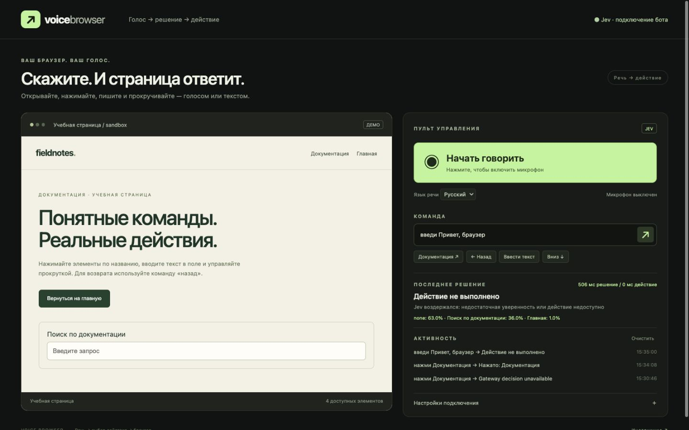

# Voice Browser

Голосовой пульт для Chrome и самостоятельный интерактивный preview. Сделан по публичному demo Moritz Kremb: https://x.com/moritzkremb/status/2100577979021832365. Адаптация использует Chrome MV3, исходный код demo при исследовании не найден. Интерфейс показывает собственные измерения времени; локальные правила не имеют вероятностей.

## Запуск

Нужен Node.js 22 или новее. В этой папке выполните `npm install`, затем `npm start`, откройте http://127.0.0.1:47831. `npm test` проверяет planner, ограничения URL, ответы Jev и отмену устаревших запросов.

В preview доступна учебная страница: «нажми Документация», «назад», «введи Привет», «прокрути вниз». Она содержит только демонстрационный контент. В расширении доступны «открой Википедию» и «go to wikipedia.com». Внешние адреса открываются только через расширение.




## Настоящая вкладка Chrome

1. Откройте `chrome://extensions`, включите режим разработчика и нажмите «Загрузить распакованное расширение».
2. Выполните `node build-extension.mjs` и выберите папку `extension/` внутри этой папки. Откройте нужную HTTP(S) страницу и нажмите иконку расширения: появится постоянная вкладка пульта, привязанная к исходной странице.
3. Разместите страницу и пульт рядом. Кнопка «Начать говорить» запрашивает микрофон только по нажатию. Текстовые команды работают всегда.
4. Для смены цели нажмите иконку расширения на другой странице. Кнопка «Разрешить управление сайтом» в настройках запрашивает доступ только к текущему сайту. После перехода на другой домен используйте эту кнопку вновь. Для подключения к Jev bridge нажмите «Подключить Jev», подтвердите на локальной странице и обновите пульт расширения.

Пульт исполняет только ограниченный набор действий над видимыми DOM элементами. Запросы в полёте отменяются новой командой и остановкой микрофона. Перед кликом подпись и тип элемента проверяются повторно. Действия с подписью отправки, оплаты или удаления требуют подтверждения в пульте. Автоматическая классификация значимости по подписи имеет ограничения: проверяйте сайт перед подтверждением.

## Jev и Gateway

Локальный сервер использует AI SDK Gateway evaluation adapter. Настройте собственный ключ Vercel AI Gateway перед запуском: 
```sh
export AI_GATEWAY_API_KEY="your-own-gateway-key"
npm ci
npm start
```

Вместо переменной ключа можно задать `GATEWAY_KEY_FILE` с путём к собственному локальному файлу ключа. Файл и переменные окружения не добавляйте в Git.

При настроенном backend ключе пульт выбирает режим Jev автоматически. `/api/status` сообщает конфигурацию, первая команда проверяет фактическое подключение. Ключ остаётся на backend. Ошибка Jev отображается явно; переход на локальные правила выбирается вручную.

Расширенный режим прямого API использует `https://api.typesafe.ai/v1/systemone`, модель `jev-1.13.0`. Вставьте собственный ключ в поле настроек. Он хранится только в памяти открытого пульта и исчезает после закрытия/обновления. Preview зависит от политики CORS провайдера; используйте расширение или bridge.

В Jev отправляются команда, заголовок страницы и подписи ограниченного списка элементов. Значения полей и пароли не собираются. Подписи страниц могут содержать личную информацию: выбирайте облачный режим осознанно. SpeechRecognition в Chrome может использовать удалённый сервис распознавания; голосовая обработка зависит от браузера и сети. Исполняются только финальные результаты речи. Распознавание живой речи наблюдалось в установленном Chrome-расширении; полная цепочка голос → Jev → действие ещё не проверена.

## Ограничения

Chrome запрещает доступ к внутренним страницам и некоторым защищённым сайтам. Закрытые Shadow DOM и вложенные сторонние iframe не поддерживаются. Canvas и визуальные элементы без DOM подписи недоступны. Локальный ввод выбирает первое доступное текстовое поле. Preview не является снимком внешней вкладки. Для работы с новой страницей может понадобиться вновь нажать иконку расширения или предоставить доступ в настройках. Пульт не исполняет код от модели. Адреса разрешены только HTTP(S).

## Проверено

`npm test`: 13 проверок прошли, ошибок 0. Реальный запрос к Jev через локальный HTTP bridge на синтетической публичной странице: ответ 200, выбор Docs с вероятностью 0.92 и confidence 0.83; 394 токена, решение за 558 мс. Browser preview проверен: click 531 мс, back 938 мс, fill 446 мс. Это отдельные измерения, скорость зависит от сети и нагрузки.

Установленное и подключённое расширение проверено на публичной Wikipedia: выбрало English с вероятностью 0.96, решение за 611 мс, действие за 30 мс; целевая вкладка открыла English Wikipedia. Chrome распознал русскую речь после включения микрофона пользователем. Полная цепочка от речи до выполненного действия пока не проверена. Подробности измерений — `verification.json`.

Bridge использует Vercel AI Gateway. Режим zero-data-retention включается переменной `JEV_ZERO_DATA_RETENTION=1` и требует соответствующего доступа у провайдера. По умолчанию флаг выключен; условия хранения данных определяются вашим аккаунтом и провайдером.

На повторной проверке preview один запрос завершился ошибкой Gateway; ручной повтор выполнил click за 555 мс решения и 2 мс действия (98%). Ввод на странице Docs дал воздержание: none 63%, поле 36%, решение 506 мс. Это наблюдавшийся ложный отказ.
